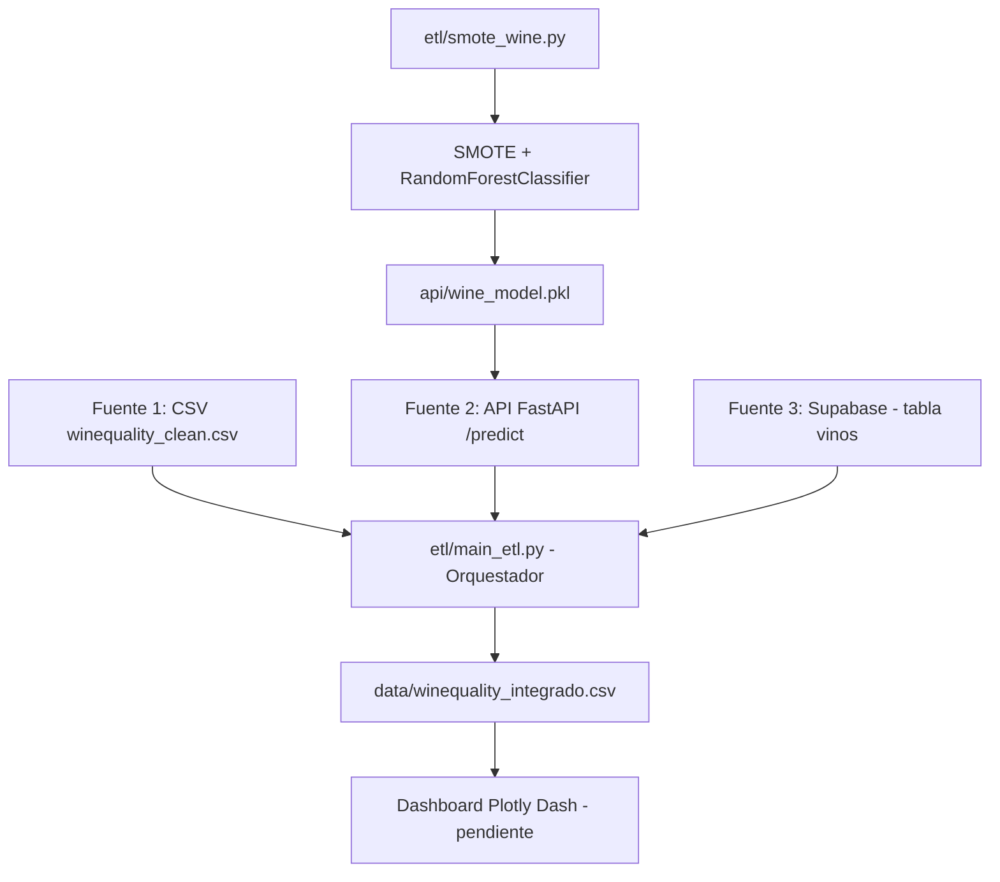

# EV3 SCY1101 — Predicción de Calidad de Vino Tinto

Sistema end-to-end que integra 3 fuentes de datos, balancea clases con SMOTE, entrena un modelo de clasificación y expone predicciones vía API.

## Arquitectura



El pipeline `smote_wine.py` regrupa la calidad en 3 clases (bajo/medio/premium), aplica SMOTE solo sobre datos de entrenamiento y entrena un RandomForestClassifier (200 estimadores). El modelo resultante se sirve a través de la API FastAPI, que actúa como Fuente 2 de datos. `main_etl.py` integra las 3 fuentes en un único dataset consolidado.

## Estructura de carpetas

/etl/         Scripts del pipeline ETL (SMOTE, orquestador)

/api/         API RESTful (FastAPI) y modelo entrenado

/data/        Datos originales y transformados

/docs/        Documentación, diagramas, manuales

/tests/       Tests automatizados (pytest)

/dashboards/  Dashboard Plotly Dash

/docker/      Dockerfiles y docker-compose

## Instalación

```bash
pip install -r requirements.txt
```

## Variables de entorno

Crear archivo `.env` en la raíz con:

SUPABASE_URL=tu_url_de_supabase

SUPABASE_KEY=tu_key_de_supabase

## Ejecución

```bash
# 1. Entrenar modelo y generar dataset balanceado
python etl/smote_wine.py

# 2. Cargar datos a Supabase
python etl/cargar_supabase.py

# 3. Levantar la API (Fuente 2)
python -m uvicorn api.main:app --reload

# 4. Ejecutar orquestador ETL (integra las 3 fuentes)
python etl/main_etl.py

# 5. Correr tests
python -m pytest
```

## Documentación adicional

- [Documentación de API](docs/API.md)
- [Manual de usuario](docs/MANUAL_USUARIO.md)
- [Guía de instalación y despliegue](docs/GUIA_INSTALACION.md)